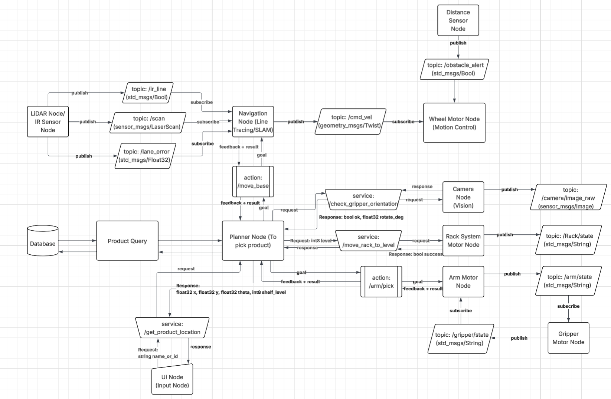
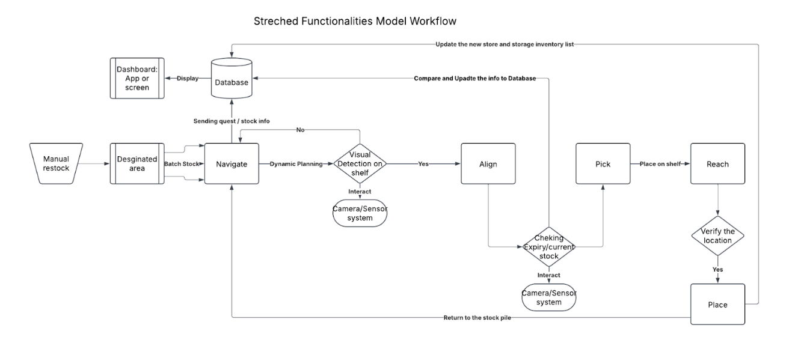

# Team 21 Grocery Robot
Our group’s vision is to make everyday shopping more efficient and inclusive. We aim to address issues that would benefit both owners and customers through an intelligent, multi-functional robotic system to improve shelf management and customer experience. Our final delivery would be a multi-wheel robot with functional robotic arm(s), sensors, cameras, and artificial intelligence to assist in employee stocking and customer shopping.

Darren Figo Sajino, Pree Simphliphan, Bach Thien Nguyen, Bernie Xu, Xingjian Jiang, Feng Tai

## Table of Contents
1. [Mission](#mission)
2. [Project Summary](#project-summary)
3. [Problems & Market Analysis](#problems-and-market-analysis)
4. [Goals](#goals)
5. [System Architecture](#system-architecture)
6. [Team Members](#team-members)
7. [Additional Links](#team-links)

---
## Mission
To design and develop an intelligent, multi-functional robotic system that streamlines shelf management and enhances customer experience in a grocery store. Our mission is to integrate robotics, sensors, and artificial intelligence to assist employees in stocking tasks, ensure product availability, and provide customers with inclusive, efficient shopping support to make daily activities more convenient.

## Project Summary
In recent years, more and more robots are being employed in order to make daily life more convenient. These systems benefit the users by freeing up time and performing tasks that require precision. The Grocery Robot aims to build a robust robotic system that will perform a wide variety of assistive functions to make grocery shopping more accessible and convenient.

The robotic system will navigate through a grocery store to restock products and assist shoppers in collecting their wanted items. To operate the system, a web application will provide the robot with the location of goods. Grocery items will be classified using computer vision, and robotic arms will grab the product. Furthermore, the robot will accommodate various users. The robot will assist delivery drivers to save time and energy, and it will be able to assist customers with special needs who may have trouble shopping by themselves.

## Problems and Market Analysis
### Market Research
Post-COVID staffing shortages in the grocery industry have created major operational challenges for store owners and employees, as well as accessibility obstacles for customers. With 68% of grocery managers rating labor availability as "difficult" or "very difficult" and turnover rates approaching 80% during the COVID peak, owners are struggling to maintain productivity and service levels. Among American adults, 61 million (one in four) are living with disabilities, and 27% of surveyed individuals with disabilities encounter accessibility barriers during shopping at least monthly. The urgent need for assistive technologies and labor-saving automation in grocery retail thus benefits both store owners and customers, improving operational efficiency and enhancing inclusivity.

### User Stories and User Requirement
- As a store owner, I want the robot to automatically restock the product to reduce the cost of human labor. 
- As a store owner, I want to have a real-time digital inventory report so I can save time waiting for the report.
- As a store employee, I want the robot to reduce my workload and focus more on more important things or serve the customers.
- As a shop customer, I want the robot to look for the product and navigate to the aisle for me, so that I will not get lost in the store.
- As a customer with special needs, I want to shop independently so that I do not have to ask my friends/relatives for help.
- As a delivery driver, I want to have my customer’s order be ready and packed when I arrive to save time. 

## Goals
### Minimum Viable Product
- Single-Aisle Navigation: fixed route in a mock aisle using line tracing mechanism for navigation with integration of LiDAR and IR Sensors. with 90% success rate under 5 minutes per operation
- Place, Verify & Recovery: Predefined motion of control of robotics arm with range of operation 2-meter height and 2-pound of payload per picking
- Approach & Alignment: Computer Vision to change the orientation of the gripper to pick up product accurately with KPI of 90% success rate
- Safety feature: distance sensor to prevent collision

### Stretch Goals
- Real-time Inventory Report with Database
- Multiple-Aisle Navigation using SLAM algorithms
- Robotics Arm Motions: Integrate Computer Vision or VLA for motion control
- Two modes for customers and store employees
- Online Order Prep from delivery drivers
- Additional Assitance feature on screen for customers
- Safety feature: avoid collision and re-route new navigation

## System Architecture

ROS2 System Architecture

Logic Workflow

### Software Stack
- Python
- ROS2
- OpenCV
- IntelRealSense SDK
- Node.js
- Gazebo
- Database (TBD)

### Hardware (Mechanical)
- 12V DC motors
- High-torque servo motors
- 3D printing components
- Mecanum wheels
- Aluminum framing (80/20 profiles and tubing)

### Hardware (Electrical & Sensing)
- 2D LiDAR Sensor (SICK TiM series)
- Odometry Sensor (MCU Gyroscope)
- IntelRealSense Camera
- Ultrasonic Sensor
- 12V lead-acid batteries (+ Fuse and Power Distribution)
- E-Stop
- Switch
- NVIDIA Jetson Nano

## Team Members
- Bach Thien Nguyen, Mechanical Engineering
- Bernie Xu, Mechanical Engineering
- Darren Figo Sajino, Mechanical Engineering
- Feng Tai, Computer Engineering
- Pree Simphliphan, Computer Engineering
- Xingjian Jiang, Computer Engineering

## Team links
- [Team Google Drive](https://drive.google.com/drive/folders/1yiAgVb-4LaUo8HKmD3yormvIIuaboWg9)

## Course links
- [ECE Senior Design Piazza Site](https://piazza.com/bu/fall2025/ec463/home)
- [Blackboard](http://learn.bu.edu/)

## Optional features links
- [Team Jira](https://seniordesign-team-21.atlassian.net/jira/software/projects/SCRUM/summary)
- Team Confluence
- Something else

