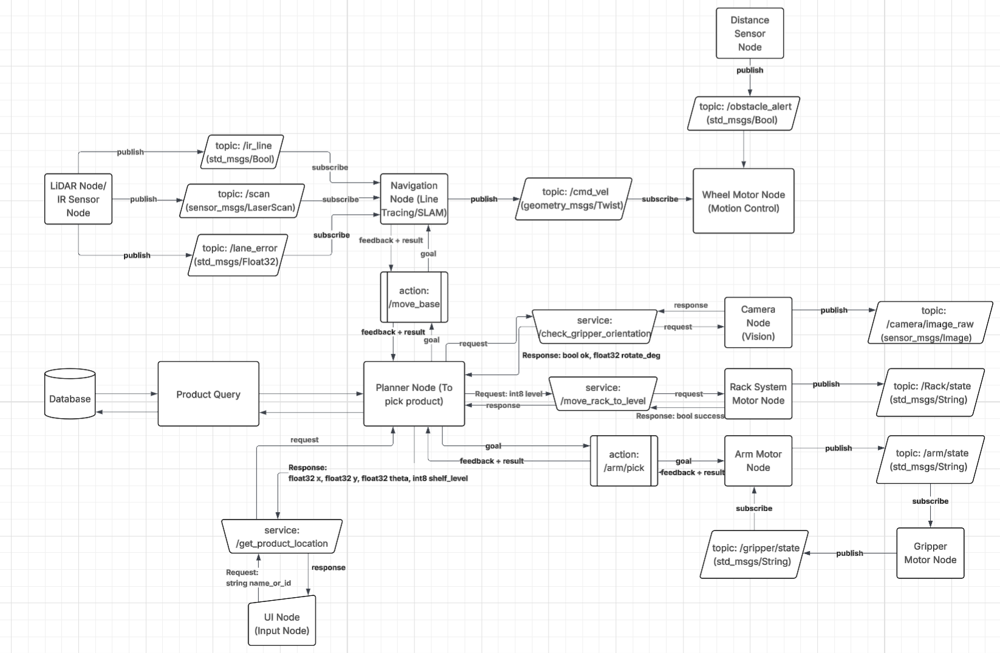
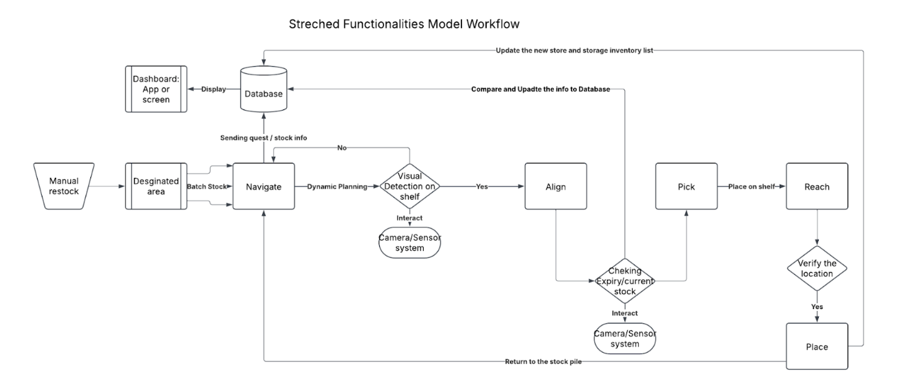

# Team 21 Grocery Robot
Our group’s vision is to make everyday shopping more efficient and inclusive. We aim to address issues that would benefit both owners and customers through an intelligent, multi-functional robotic system to improve shelf management and customer experience. Our final delivery would be a multi-wheel robot with functional robotic arm(s), sensors, cameras, and artificial intelligence to assist in employee stocking and customer shopping.

Darren Figo Sajino, Pree Simphliphan, Bach Thien Nguyen, Bernie Xu, Xingjian Jiang, Feng Tai

## Table of Contents
1. [Mission](#mission)
2. [Project Summary](#project-summary)
3. [Repository Guide](#repository-guide)
4. [Problems & Market Analysis](#problems-and-market-analysis)
5. [Goals](#goals)
6. [System Architecture](#system-architecture)
7. [Team Members](#team-members)
8. [Advisor](#advisor)
9. [Additional Links](#team-links)

---
## Mission
To design and develop an intelligent, multi-functional robotic system that streamlines shelf management and enhances customer experience in a grocery store. Our mission is to integrate robotics, sensors, and artificial intelligence to assist employees in stocking tasks, ensure product availability, and provide customers with inclusive, efficient shopping support to make daily activities more convenient.

## Project Summary
In recent years, more and more robots are being employed in order to make daily life more convenient. These systems benefit the users by freeing up time and performing tasks that require precision. The Grocery Robot aims to build a robust robotic system that will perform a wide variety of assistive functions to make grocery shopping more accessible and convenient.

GOFR, short for Grocery Operations & Fulfillment Robot, is an autonomous retail assistant built to support both shopping and restocking workflows. The goal is not to replace store employees, but to reduce repetitive operational burden and improve customer access in environments where reliable staffing and quick item fulfillment matter every day.

At a system level, GOFR combines store-scale mobility with item-level interaction. Customer or staff requests originate in the web app and backend, are resolved against a semantic store map, and are then executed by the ROS 2 autonomy stack. The robot localizes with LiDAR, odometry, and IMU inputs, navigates using Cartographer and Nav2, and uses camera-based perception to verify and align on target items before manipulation. This creates one continuous pipeline from store request to in-aisle execution.

## Repository Guide

The repository is organized around those major subsystems:

- `workspace/src/robot_navigation`: ROS 2 navigation, mapping, localization, Nav2 tuning, semantic map serving, teleoperation, and STM32 serial bridging
- `workspace/src/robot_interfaces`: shared ROS 2 custom message, service, and action definitions used across navigation, manipulation, and task execution modules
- `workspace/src/robot_manipulation`: robotic arm control, MoveIt integration, Gazebo simulation assets, waypoint/action servers, and rack interaction logic
- `workspace/src/robot_task_manager`: Behavior Tree-based task orchestration for customer and restock workflows, blackboard state management, order intake, semantic target resolution, and robot action sequencing
- `workspace/src/robot_vision`: RealSense and camera perception nodes, barcode utilities, and YOLO-based vision components
- `workspace/src/robot_perception`: Ultrasonic Sensors nodes for collision detection
- `order-api-postgre`: Node.js + PostgreSQL backend for customer orders, inventory, authentication, and semantic map data
- `order-api-postgre/fleet-manager`: Vue-based fleet and operations dashboard for maps, inventory reporting, robot status, and AI-assisted views
- `ESP32` and `STM32`: embedded control, sensor integration, ultrasonic experiments, and base-control firmware
- `Maps`, `images`, and `third_party`: saved maps, project assets, and vendored dependencies used by the dashboards and robot stack

## Problems and Market Analysis
### Market Research
Grocery is one of the largest everyday retail sectors in the world. Based on the team presentation research, the global grocery retail market was valued at roughly $12 trillion in 2023 and is projected to approach $15 trillion by 2030. That scale means even small improvements in stocking efficiency, order fulfillment speed, or shopping accessibility can have meaningful operational impact.

At the same time, grocery stores continue to face persistent labor and workflow pressure. The project research found that 68% of grocery managers report difficulty finding labor for ongoing day-to-day operations. Grocery retail depends on constant movement: checking shelves, restocking items, answering shopper questions, and preparing online or delivery orders. These tasks are repetitive, time-sensitive, and difficult to sustain when staffing is limited. When labor falls short, shelves remain empty longer, order preparation slows down, and employees are forced to divide attention between logistics and customer support.

Accessibility is another major gap in the sector. About 1 in 4 U.S. adults live with a disability, and the presentation research notes that more than 27% of people with disabilities experience a shopping barrier at least occasionally more than once per month. In a grocery setting, that can mean difficulty locating items, reaching products, navigating crowded aisles, or shopping independently without assistance. This makes grocery automation not just an efficiency problem, but also an inclusion problem.

These conditions create a clear opportunity for an assistive retail robot. GOFR is positioned to address both sides of the market need: operational support for stores and improved shopping support for customers. Unlike systems focused only on monitoring inventory, GOFR is intended to connect navigation, perception, and manipulation into one platform that can move through a store, identify a target area, verify products, and participate directly in fulfillment or restocking tasks.

### User Stories and User Requirement
- As a store owner, I want the robot to automatically restock the product to reduce the cost of human labor. 
- As a store owner, I want to have a real-time digital inventory report so I can save time waiting for the report.
- As a store employee, I want the robot to reduce my workload and focus more on more important things or serve the customers.
- As a shop customer, I want the robot to look for the product and navigate to the aisle for me, so that I will not get lost in the store.
- As a customer with special needs, I want to shop independently so that I do not have to ask my friends/relatives for help.
- As a delivery driver, I want to have my customer’s order be ready and packed when I arrive to save time. 

## Goals
### Minimum Viable Product
- Single-Aisle Navigation: fixed route in a mock aisle using line tracing mechanism for navigation with integration of LiDAR and IR Sensors. with 90% success rate under 5 minutes per operation
- Place, Verify & Recovery: Predefined motion of control of robotics arm with range of operation 2-meter height and 2-pound of payload per picking
- Approach & Alignment: Computer Vision to change the orientation of the gripper to pick up product accurately with KPI of 90% success rate
- Safety feature: distance sensor to prevent collision

### Stretch Goals
- Real-time Inventory Report with Database
- Multiple-Aisle Navigation using SLAM algorithms
- Robotics Arm Motions: Integrate Computer Vision or VLA for motion control
- Two modes for customers and store employees
- Online Order Prep from delivery drivers
- Additional Assitance feature on screen for customers
- Safety feature: avoid collision and re-route new navigation

## System Architecture

ROS2 System Architecture

Logic Workflow

### Software Stack
- Python
- C++
- ROS2 Humble
- Behavior Tree (pytrees)
- OpenCV
- YOLO Model
- IntelRealSense SDK
- Node.js
- Vue.js
- HTML
- CSS
- Javascript
- Gazebo
- Moveit2
- C
- ESP-IDF (Espressif)
- Database (Postgresql)
- Gemini API

### Hardware (Mechanical)
- 12V DC motors -> DJI Motors
- High-torque servo motors
- 3D printing components (PETG)
- Mecanum wheels
- Aluminum framing (80/20 profiles and tubing)
- Acylic Plate
- ViperX 300S Robotic Arm

### Hardware (Electrical & Sensing)
- 2D LiDAR Sensor (SICK picoscan150)
- Odometry Sensor (MCU Gyroscope)
- IntelRealSense Camera
- Ultrasonic Sensors
- 12V lead-acid batteries (+ Fuse and Power Distribution)
- ESP32
- STM32
- Remote E-Stop
- NVIDIA Jetson Nano

## Team Members
- Bach Thien Nguyen, Mechanical Engineering
- Bernie Xu, Mechanical Engineering
- Darren Figo Sajino, Mechanical Engineering
- Feng Tai, Computer Engineering
- Pree Simphliphan, Computer Engineering
- Xingjian Jiang, Computer Engineering

## Advisor
- Professor Thomas Little

### EC463-464 Instuctors
- Professor Thomas Little
- Professor Ryan Lagoy
- Professor Osama Alshaykh

## Team links
- [Team Google Drive](https://drive.google.com/drive/folders/1yiAgVb-4LaUo8HKmD3yormvIIuaboWg9)

## Course links
- [ECE Senior Design Piazza Site](https://piazza.com/bu/fall2025/ec463/home)
- [Blackboard](http://learn.bu.edu/)

## Optional features links
- [Team Jira](https://seniordesign-team-21.atlassian.net/jira/software/projects/SCRUM/summary)
- Team Confluence
- Something else
